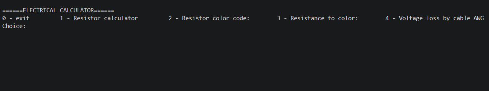

# Electrical Calculator CLI
 
a C++ tool for electrical engineers and students to automate circuit calculations and component selection.

---

## Features
* **Resistor Calculator:** Calculate total resistance for Seroes and Parallel circuits.
* **Color Code Decoder:** Decode resistor values and tolerances from color bands.
* **AWG Analysis:** Calculate voltage loss and resistance based on American Wire Gauge standarts.
* **Voltage Divider:** Precise calculation of output voltages (in Development).

## Preview

## Roadmap & Future Developments.

### Completed
- [x] **Resistor Networks:** Serial and Parallel equivalent resistance.
- [x] **Color Code Engine:** 4-band resistor decoding (Value to Color & Color to Value).
- [x] **AWG Standards:** Voltage drop and resistance calculations for power cables.

### In Progress
- [ ] **Voltage Divider:** Precise $V_{out}$ calculation with load consideration.
- [ ] **Delta-Wye ($\Delta-Y$) Transformation:** Automated conversion for complex bridge circuits.

### Planned
- [ ] **PCB Trace Width Calculator:** Calculating trace width based on IPC-2221 standards (Current vs. Temperature rise).
- [ ] **LED Current Limiter:** Selection of protective resistors based on forward voltage ($V_f$) databases.
- [ ] **Capacitive/Inductive Reactance:** Calculating impedance for AC circuit analysis.

## Usage Policy
This project is for display in my **personal portfolio only**.
Unauthorized copying, distribution, or use of this code for other projects or commercial purposes is strictly prohibited. 
All rights reserved © 2026.
